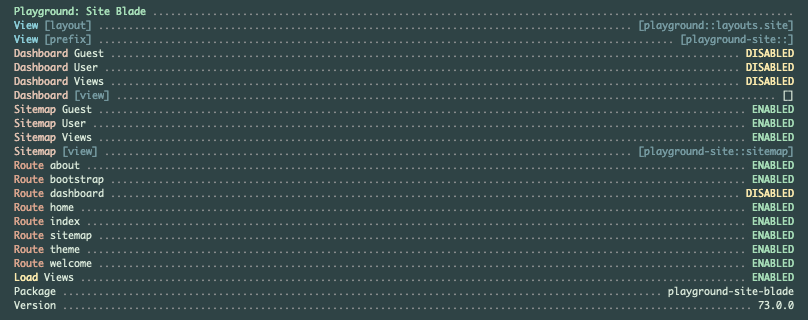

# Playground Site Blade

[](https://raw.githubusercontent.com/gammamatrix/playground-site-blade/testing/develop/testdox.txt)
[](tests)
[](.github/workflows/ci.yml#L120)

The Playground Site Blade package for [Laravel](https://laravel.com/docs/11.x) applications.

This package provides a standard website with:
- Bootstrap Theme Handling
- Dashboard
- Home and Index
- Sitemap
- Welcome
- CMS integration

Read more on using Playground Site Blade [at the Read the Docs for Playground.](https://gammamatrix-playground.readthedocs.io/)

## Installation

You can install the package via composer:

```bash
composer require gammamatrix/playground-site-blade
```

## `artisan about`

Playground Site Blade provides information in the `artisan about` command.



## Configuration

You can publish the config file with:
```bash
php artisan vendor:publish --provider="Playground\Site\Blade\ServiceProvider" --tag="playground-config"
```

See the contents of the published config file: [config/playground-site-blade.php](config/playground-site-blade.php)

You can publish the views file with:
```bash
php artisan vendor:publish --provider="Playground\Site\Blade\ServiceProvider" --tag="playground-views"
```

### Environment Variables

If you are unable or do not want to publish [configuration files for this package](config/playground-site-blade.php),
you may override the options via system environment variables.

Information on [environment variables is available on the wiki for this package](https://github.com/gammamatrix/playground-site-blade/wiki/Environment-Variables)

## PHPStan

Tests at level 9 on:
- `config/`
- `database/`
- `resources/views/`
- `routes/`
- `src/`
- `tests/Feature/`
- `tests/Unit/`

```sh
composer analyse
```

## Coding Standards

```sh
composer format
```

## Testing

```sh
composer test
```

## Changelog

Please see [CHANGELOG](CHANGELOG.md) for more information on what has changed recently.

## Credits

- [Jeremy Postlethwaite](https://github.com/gammamatrix)

## License

The MIT License (MIT). Please see [License File](LICENSE.md) for more information.
