# Playground Site Blade

[](https://raw.githubusercontent.com/gammamatrix/playground-site-blade/testing/develop/testdox.txt)
[](tests)
[](.github/workflows/ci.yml#L120)

The Playground Site Blade package for [Laravel](https://laravel.com/docs/11.x) applications.

This package provides a standard website with:
- Bootstrap Theme Handling
- Dashboard
- Home and Index
- Sitemap
- Welcome
- CMS integration

Read more on using [Playground Site Blade at Read the Docs: Playground Documentation.](https://gammamatrix-playground.readthedocs.io/en/develop/components/site.html)

## Installation

You can install the package via composer:

```bash
composer require gammamatrix/playground-site-blade
```

## `artisan about`

Playground Site Blade provides information in the `artisan about` command.

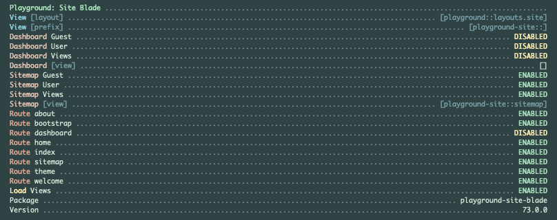

## Configuration

You can publish the config file with:
```bash
php artisan vendor:publish --provider="Playground\Site\Blade\ServiceProvider" --tag="playground-config"
```

See the contents of the published config file: [config/playground-site-blade.php](config/playground-site-blade.php)

You can publish the views file with:
```bash
php artisan vendor:publish --provider="Playground\Site\Blade\ServiceProvider" --tag="playground-views"
```

### Environment Variables

If you are unable or do not want to publish [configuration files for this package](config/playground-site-blade.php),
you may override the options via system environment variables.

Information on [environment variables is available on the wiki for this package](https://github.com/gammamatrix/playground-site-blade/wiki/Environment-Variables)

## UI

<section>

<details open>

<summary>Toggle UI screenshots</summary>

### Sitemap

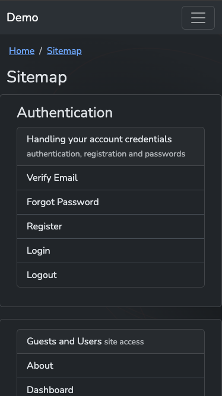

- Sitemap loaded in a mobile view with dark mode

#### Authorization checks in Sitemaps

All sitemaps are expected to perform `Route::has($route)` checks and verify the user has access against the ACLs.

For example, this is in the CMS sitemap blade:

```php
<?php
$user = \Illuminate\Support\Facades\Auth::user();

$viewPages = \Playground\Auth\Facades\Can::access($user, [
    'allow' => false,
    'any' => true,
    'privilege' => 'playground-cms-resource:page:viewAny',
    'roles' => ['admin', 'manager', 'publisher'],
])->allowed();

$viewSnippets = \Playground\Auth\Facades\Can::access($user, [
    'allow' => false,
    'any' => true,
    'privilege' => 'playground-cms-resource:snippet:viewAny',
    'roles' => ['admin', 'manager', 'publisher'],
])->allowed();


if (!$viewPages && !$viewSnippets) {
    return;
}
?>
```
- Where applicable, policies are used on the routes. `\Playground\Auth\Facades\Can::access()` checks against the enabled authorization options.

#### playground-admin-resource

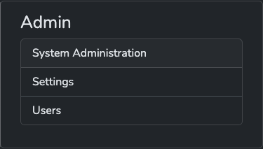

- See [gammamatrix/playground-admin-resource/resources/views/sitemap.blade.php](https://github.com/gammamatrix/playground-admin-resource/blob/develop/resources/views/sitemap.blade.php)

#### playground-cms-resource

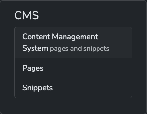

- See [gammamatrix/playground-cms-resource/resources/views/sitemap.blade.php](https://github.com/gammamatrix/playground-cms-resource/blob/develop/resources/views/sitemap.blade.php)

#### playground-crm-resource

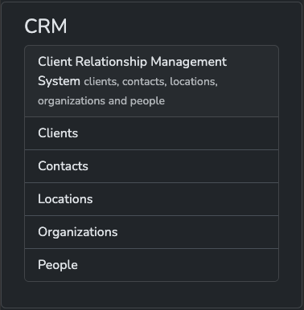

- See [gammamatrix/playground-cms-resource/resources/views/sitemap.blade.php](https://github.com/gammamatrix/playground-cms-resource/blob/develop/resources/views/sitemap.blade.php)

#### playground-directory-resource

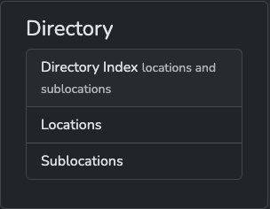

- See [gammamatrix/playground-directory-resource/resources/views/sitemap.blade.php](https://github.com/gammamatrix/playground-directory-resource/blob/develop/resources/views/sitemap.blade.php)

#### playground-lead-resource

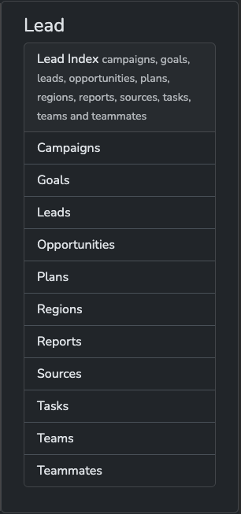

- See [gammamatrix/playground-lead-resource/resources/views/sitemap.blade.php](https://github.com/gammamatrix/playground-lead-resource/blob/develop/resources/views/sitemap.blade.php)

#### playground-login-blade

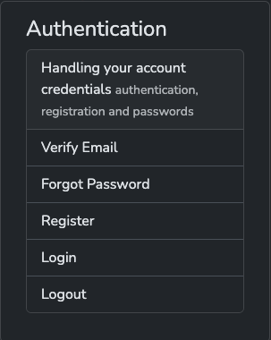

- See [gammamatrix/playground-login-blade/resources/views/sitemap.blade.php](https://github.com/gammamatrix/playground-login-blade/blob/develop/resources/views/sitemap.blade.php)

#### playground-matrix-resource

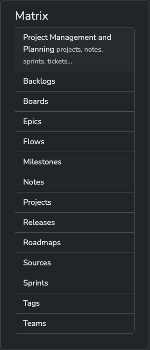

- See [gammamatrix/playground-matrix-resource/resources/views/sitemap.blade.php](https://github.com/gammamatrix/playground-matrix-resource/blob/develop/resources/views/sitemap.blade.php)

#### playground-site-blade

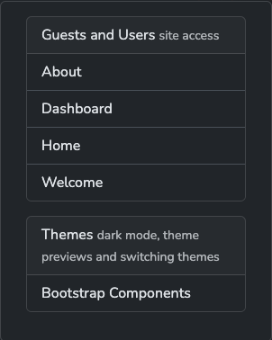

- See [gammamatrix/playground-site-blade/resources/views/sitemap.blade.php](https://github.com/gammamatrix/playground-site-blade/blob/develop/resources/views/sitemap.blade.php)

### Theme

This application supports themes, with Bootstrap 5 using CSS Variables.

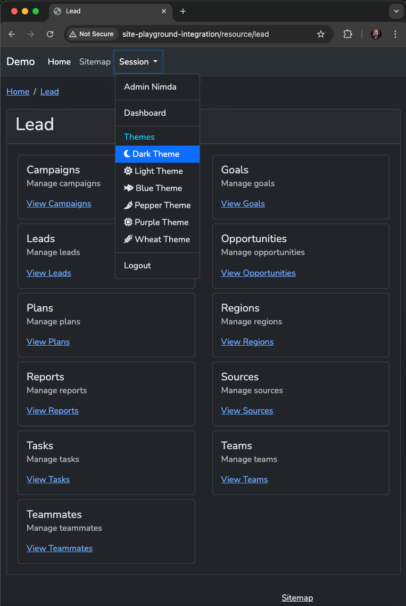

</details>

</section>


## Cloc

```sh
composer cloc
```

```
➜  playground-site-blade git:(develop) ✗ composer cloc
> cloc --exclude-dir=output,vendor .
      92 text files.
      71 unique files.
      23 files ignored.

github.com/AlDanial/cloc v 1.98  T=0.12 s (604.9 files/s, 45491.7 lines/s)
-------------------------------------------------------------------------------
Language                     files          blank        comment           code
-------------------------------------------------------------------------------
PHP                             46            513            729           2369
Blade                           16            125             14            880
YAML                             1              5              0            275
XML                              3              0              2            217
Markdown                         3             42              0             87
JSON                             1              0              0             67
INI                              1              3              0             12
-------------------------------------------------------------------------------
SUM:                            71            688            745           3907
-------------------------------------------------------------------------------
```

## PHPStan

Tests at level 9 on:
- `config/`
- `database/`
- `resources/views/`
- `routes/`
- `src/`
- `tests/Feature/`
- `tests/Unit/`

```sh
composer analyse
```

## Coding Standards

```sh
composer format
```

## Testing

```sh
composer test
```

## Changelog

Please see [CHANGELOG](CHANGELOG.md) for more information on what has changed recently.

## Credits

- [Jeremy Postlethwaite](https://github.com/gammamatrix)

## License

The MIT License (MIT). Please see [License File](LICENSE.md) for more information.
